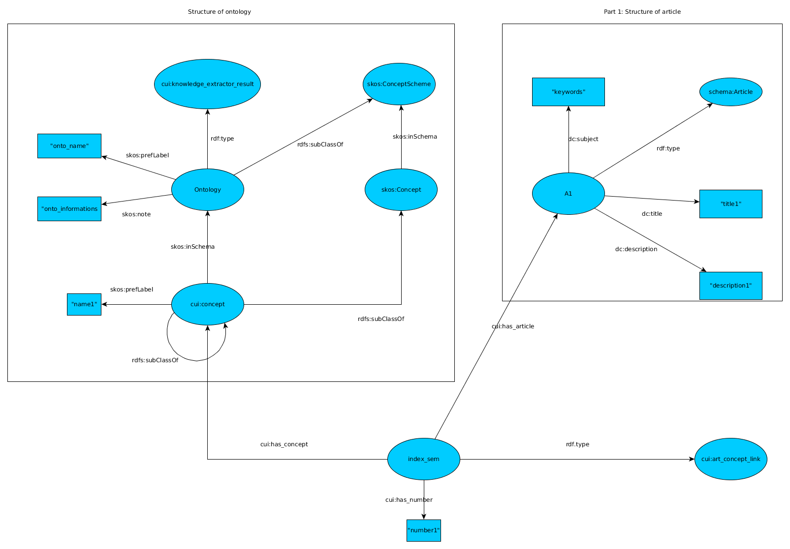

# RUKI: Reconciliation and unification for knowledge information
-------


## Extracts (extract_abstract)

First part of project is to extract abstract of publications on the website:  
http://vgibox.eu/repository/index.php/Main_Page  
(Page of all publications: http://vgibox.eu/repository/index.php/Category:Publication)

The script use the api of mediawiki for query:  
https://www.mediawiki.org/wiki/API:Query

We collect all abstract of all publications with different possibility.
You have two possibility:
* You can write your collect informations into file(s)
* You can call function into your code to obtain a dictionnary
with all informations about article

### Usage

If you want to use this code it's very simple, you just need to modify
the config file and call the script like this:

``
python3 extract_abstracts.py
``

You can see your file/files fill with abstracts.  

### Configuration

This is an configuration example of what you have:

```yaml
url: 'http://vgibox.eu/repository/api.php'

# Parameters to have id list
# continue is just to silence the warning

parameters_id:
  action: 'query'
  format: 'json'
  list: 'categorymembers'
  # cmtitle: 'Category:VGI_Domain'
  cmtitle: 'Category:Publication'
  continue: ''

# Paramaters to extract content of a page
parameters_extract_content:
  action: 'query'
  format: 'json'
  prop: 'revisions'
  rvprop: 'content'

output:
  file: 'Results/Extracts/Single/abstracts'
  folder: 'Results/Extracts/Multiple/'

options:
  writing: true
  multiple_file: true
  xml: false
  keywords: false
  title: false
  csv: false

```

You have some options to complete the collect (with true or false):  
* writing: You decide if you want to have an output. If this parameter is false
the rest has any importance.
* multiple_file: You can decide to have one abstract per file or just one file with all abstracts
* id: Can print id of the document on the website
* keywords: Moreover abstracts, you can add keywords that are avaible in the same page of abstract to have more informations
* title: Same as keywords for title
* xml: You can add tags for parsing easier your file. If you want to handle your file(s) differently because the weight of a keyword is not the same that a word.
* csv: You can have an other output in a csv format. The columns where the first is just the same name 'vgi', the second 'id' of the article and the third a compilation of title, keywords and abstract.

XML hierarchy:

* < informations > (This tag appear only if you put false for multiple_file)
  * < article >
    * < id > ... < /id >
    * < title > ... < /title >  
    * < keyword >keyword_1< /keyword >...<keyword>keyword_n< /keyword >
    * < sentences > ... < /sentences >
  * < /article>
* < /informations >

Normally, you just need to modify 'output' and 'options'.

### output

As we said earlier you have two possibility:
* You can write your collect informations into file(s)
* You can call function into your code to obtain a dictionnary
with all informations about article

In all case the mainly function:  
`extract_abstracts(config_file)`
Return a generator (yield) which contains doc_id (document id) and dic_content (dictionnary content)
When you use a yield, the dictionnary is filled through time. So you need to keep
doc_id to know which article you're processing.

In the easiest way this python code return you a single/multiple file with all informations
that you've chosen.
But you can just collect articles with the dictionnary and process informations as you want.

Return is: `yield doc_id, dic_content`

If you want to know how yield works:   
[Yield stackoverflow](https://stackoverflow.com/questions/231767/what-does-the-yield-keyword-do)  
[Yield tuto](https://www.python-course.eu/python3_generators.php)


## Knowledge graph (construct_knowledge_graph)

In this part we want to construct our Knowledge graph in rdf.
We used the first part with extraction of abstracts (and other informations)
to create a graph where we can rewrite it in a good format. (RDF/n3)

We use mainly: [RDFLib](https://github.com/RDFLib/rdflib)

This is our rdf graph to vizualise the structure:


We can see two mainly parts but for this part only one will be interresting.
At the beginning what we have is a lot article with some informations like
title, keywords or abstract.
We want to express our structure with rdf and we obtain the part 1 that we've described
in our schema.

For this part we use the dictionnary that we've obtained with the extraction of abstracts.
We don't use directly output file but we reconstruct the rdf file with the dictionnary which
contains all informations. When it's right, we use RDFLib to translate our informations
into rdf format.


## OWL in python3 (extract_onto_concepts)

For this part we want to collect all concept in ontologies to compare
with all informations that we had previously. The goal is simple, if the name of
a concept is a same in informations (title, keywords, abstract) about an article, we keep (and count) it.

For this part we use [Owlready2](https://pypi.python.org/pypi/Owlready2) / [Nltk](http://www.nltk.org/)  
When nltk is downloaded launch ntlk with python3
```bash
import nltk
nltk.download()
```
It's open a window where we can choose different module for installation.
You have to go in "Corpora" and install "stopwords".

Owlready allow us to extract concept of an owl file.

The second part of our latest graph represent the structure of an ontology with all concepts
that it contains.

The final link between Ontology and article is made by a link which is "index_sem1".
We link the term and the article where it appears. Moreover we add an information about
the number of occurence.

This part return us a specific dictionnary with this format:  
dic = {'onto1':{'abstract1':{'concept1': nb_occurence},...},...}
For every ontology we have all abstract with all concepts and their numbers.
We can decide in the config file to write into a file the rdf format of the result.
But we can just have this dictionnary to process on it.

## Add an other method (add_method_knowledge_graph)

Now i suppose that we have our knowledge graph and you want add your own analysis. For example you're trying to use a different method like clustering and you want to add it in the knowledge graph.
The goal here is just to create an rdf graph with your results. You need to create a file with this specific format:

```bash
||method_name|my_method_name||method_informations|my_method_informations
file_id1, file_id2, file_id3
file_id4
file_id5, file_id6
```

#### Where:
* The first line is optional (must be the first line), but you can add specific informations like the name of your method or informations about your method. You can have just one, don't need to have the two to work. The syntax must be respected with **||** and **|**. **||** is needed to separate tags and **|** give us the good information for every tags.
* Every line except this optional line is a group of article id. If many id article are in the same line, it means that documents are in the same group.
So for the last example, we have 3 id documents together in the second line, 1 for the third line and 2 for the last line.
